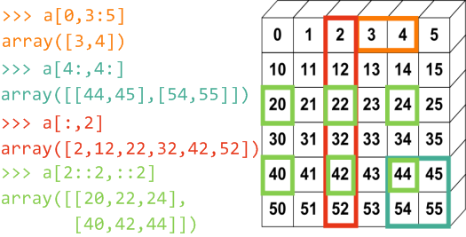

# Python科学计算神器之Numpy-3

> * 这节承接Numpy-2, 对多维数组和一些通用规则进行学习

> * 在此非常感谢大家为我做的分享推广，特别是感谢*生信技能树*的小伙伴, 那里不仅仅有全面翔实的生信知识，更有思维的碰撞. 如果喜欢就关注吧，也许下一次也会喜欢呢. 

### 4.5 多维数组的存取


```python
import numpy as np
```


```python
# 采用fromfunction创建多维数组
def f(x, y):
    return 10*x + y
a = np.fromfunction(f, (6,6), dtype=int)
a
```


    array([[ 0,  1,  2,  3,  4,  5],
           [10, 11, 12, 13, 14, 15],
           [20, 21, 22, 23, 24, 25],
           [30, 31, 32, 33, 34, 35],
           [40, 41, 42, 43, 44, 45],
           [50, 51, 52, 53, 54, 55]])


```python
# 另一种创建该数组的方法，需要用到Broadcasting rules，后续会讲到
np.arange(0, 60, 10).reshape(-1, 1) + np.arange(0, 6)
```


    array([[ 0,  1,  2,  3,  4,  5],
           [10, 11, 12, 13, 14, 15],
           [20, 21, 22, 23, 24, 25],
           [30, 31, 32, 33, 34, 35],
           [40, 41, 42, 43, 44, 45],
           [50, 51, 52, 53, 54, 55]])


#### 4.5.1 多维数组的indexing，Slicing
* 同一维数组一致，采用和Python的list操作一样的方式可以取值，但仍然是共享数据空间.
* 多维数组中，索引可以tuple格式出现，例如： a[0,3] = a[0][3]


```python
# 如果是单个值，则为相应数据类型;如果是多个值，则为Array数组
a[0,3], a[0][3], a[0,3:5], a[0][3:5], type(a[0,3]), type(a[0,3:])
```


    (3, 3, array([3, 4]), array([3, 4]), numpy.int64, numpy.ndarray)



    图1 使用数组切片语法访问多维数组中的元素


```python
# 注意下面slicing越界，numpy并不报错，按到边界为止
# 每个维度取值方式同一维数组一致
a[4:9,4:]
```


    array([[44, 45],
           [54, 55]])


```python
a[4:9,4:].shape, a[4:,4:].shape # shape并不是（8, 2）
```


    ((2, 2), (2, 2))


```python
b = a[0,3]
b = -100
```


```python
a
```


    array([[ 0,  1,  2,  3,  4,  5],
           [10, 11, 12, 13, 14, 15],
           [20, 21, 22, 23, 24, 25],
           [30, 31, 32, 33, 34, 35],
           [40, 41, 42, 43, 44, 45],
           [50, 51, 52, 53, 54, 55]])


#### 4.5.2 使用整数序列和布尔数组进行存取
 此时和一维数组一致，它们不共享数据空间. 类似坐标系对应的x轴和y轴，多维数组每一个维度为一个轴，对应第0轴、第1轴...(二维也称横轴、纵轴)
    * a[(0,1,2,3,4),(1,2,3,4,5)] : 用于存取数组的下标和仍然是一个有两个元素的组元，组元中的每个元素都是整数序列，分别对应数组的第0轴和第1轴。从两个序列的对应位置取出两个整数组成下标： a[0,1], a[1,2], ..., a[4,5].
    * a[3:, [0, 2, 5]] : 下标中的第0轴是一个范围，它选取第3行之后的所有行；第1轴是整数序列，它选取第0, 2, 5三列.
    * a[mask, 2] : 下标的第0轴是一个布尔数组，它选取第0，2，5行；第1轴是一个整数，选取第2列.
    
   
    图2  使用整数序列和布尔数组访问多维数组中的元素

### 4.6 特殊的indexing、Slicing方法和Iterating

#### 4.6.1 缺失的索引轴
当多维数组提供的索引数少于轴数时，缺失的轴默认是全部包含，这点和Python的list以及Pandas都是相同的. 对于每个轴均可以按照一位数组来索引取值.


```python
# 最后一行，等同于b[-1,:]
a[-1]
```


    array([50, 51, 52, 53, 54, 55])


#### 4.6.2 关于(...)的使用
Numpy可以用...来补全缺失的索引轴，例如：b[i,:]可以被写为b[i, ...]. 通常有如下三种情况：
* x[1, 2, ...] 等同 x[1，2，:，:，:]
* x[..., 3] 等同 x[:，:，:，:，3]
* x[4, ..., 5, :] 等同 x[4, :, :, 5, :]


```python
b = np.array([[[0, 1, 2], [5, 6, 7]], [[100, 101, 102],[110, 112, 113]]])
b
```


    array([[[  0,   1,   2],
            [  5,   6,   7]],
    
           [[100, 101, 102],
            [110, 112, 113]]])


```python
b.shape
```


    (2, 2, 3)


```python
b[1, ...]
```


    array([[100, 101, 102],
           [110, 112, 113]])


```python
b[1,...,2]
```


    array([102, 113])


* **Iterating**:多维Array的总是值第一个轴，即第0轴


```python
for row in b:
    print(row)
```

    [[0 1 2]
     [5 6 7]]
    [[100 101 102]
     [110 112 113]]


* **flat**:如果需要获取数组中每个元素，则使用Array的flat属性. 


```python
for element in b.flat:
    print(element)
```

    0
    1
    2
    5
    6
    7
    100
    101
    102
    110
    112
    113


* 当某个轴的元素为-1时，将根据数组元素的个数自动计算此轴的长度.


```python
b.shape = -1
b
```


    array([  0,   1,   2,   5,   6,   7, 100, 101, 102, 110, 112, 113])


* **ndenumerate**:就像我们期望的Python的list那样，Numpy当然提供了枚举函数ndenumerate(). 当然，Iteration默认是有next()方法的.


```python
c = np.array([[1, 2], [3, 4]])
```


```python
for index, x in np.ndenumerate(c):
    print(index, x)
```

    ((0, 0), 1)
    ((0, 1), 2)
    ((1, 0), 3)
    ((1, 1), 4)


```python
np.ndenumerate(c)
```


    <numpy.lib.index_tricks.ndenumerate at 0x7f21cc0dbb90>


```python
np.ndenumerate(c).next()
```


    ((0, 0), 1)


* **indices**:Numpy提供了indices()函数. shape属性提供了Array每个维度的长度. 如果一个Array的shape返回的是长度为N 的tuple (r0, ..., rN-1), indices返回的tuple就是(N, r0, ..., rN-1), 第一个值为Array的维数，也即为Array的轴数.

* 函数原型：numpy.indices(dimensions, dtype= &lt;type 'int'>)
* *grid.shape = (len(dimensions),) + tuple(dimensions)*


```python
grid = np.indices((2,3)) 
```


```python
grid.shape
```


    (2, 2, 3)


```python
# row indices
grid[0]
```


    array([[0, 0, 0],
           [1, 1, 1]])


```python
# column indices
grid[1]
```


    array([[0, 1, 2],
           [0, 1, 2]])


将indices用于Array的索引：


```python
# 获取的是前2行和前3列
row, col = np.indices((2, 3))
a[row, col]
```


    array([[ 0,  1,  2],
           [10, 11, 12]])


```python
# 更直接的方式
a[:2, :3]
```


    array([[ 0,  1,  2],
           [10, 11, 12]])


* 另外需要注意，a[(1, 2), ]和a[(1, 2)]的不同，后者等同于a[1 , 2]，前者相当于第0轴按整数取值，其他轴缺失.


```python
a[(1, 2),]
```


    array([[10, 11, 12, 13, 14, 15],
           [20, 21, 22, 23, 24, 25]])


```python
a[(1, 2)], a[1, 2]
```


    (12, 12)


关于Numpy的取值部分除了某些tricks算比较完整了，后续先对Array的特性做进一步的介绍，然后再整体对某些比较trick的tricks进行学习.

Enjoy it~

-----------------------------


